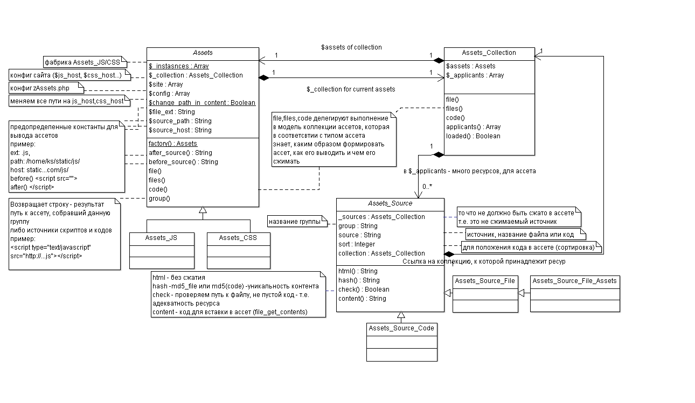

# zAssets

_Сбор и сжатие CSS/JS в одном файле._

## Конфиг
~~~
return array(
    // Включено/выключено сжатие и сбор в ассеты
    // Для разработки не сжимаем, нужно видеть код
    'active' => Kohana::$environment==Kohana::PRODUCTION,
     // must be writeable - куда ложить ассеты (полный путь)
    'path' => PROJECT_BASE.'/static/assets/',
    // внешний путь к ассетам (URL)
    'host' => Kohana::$config->load('ks.general.static_host').'/assets/',
     // метод сжатия CSS ассетов
    'css_compress' => '/usr/local/lib/node_modules/sqwish/bin/sqwish',
    // метод сжатия JS ассетов
    'js_compress' => '/usr/local/lib/node_modules/uglify-js/bin/uglifyjs',
    // полный путь к css хранилищу
    'css_path' => PROJECT_BASE.'/static/css/',
     // полный путь к js хранилищу
    'js_path' => PROJECT_BASE.'/static/js/',

    //TODO сделать через гирмана
    // файл для записи комманд на сжатие (потом обрабатывается по CRON 'у)
    'compress_queue' => PROJECT_BASE.'/var/zassets/compress.queue',
);
~~~
## Использование

### Инициализация
~~~
<?php
Assets::factory('css')
            ->files('head', array(
                'style.css',
                'ui/smoothness/style.css',
                'plugin/select2.css',
            ), 100);

Assets::factory('js')
            ->files('head', array(
                'core/jquery.js',
                'gadgets/user/auth.js',
            ), 100);

// еще где-нибудь захотим добавить файл с низким приоритетом (по умолчанию 0)
Assets::factory('js')->file('head', 'file.js');

//или css код
Assets::factory('css')->code('head', '.my-class{color: red;}');
~~~

### Вывод результата
~~~
...
<head>
    <?=Assets::factory('css')->group('head')?>
    ....
    <?=Assets::factory('js')->group('head')?>
~~~

## Особенности
[!!] По умолчанию, в соответствии с настройками ассетов, все пути к источникам (картинкам, шрифтам ...) будут дополняться js_host или css_host (пример: background: (/images/file.jpg) изменит на background: ('http://static.domen.com/images/file.jpg'));
В классе Assets есть статическая переменная public static $change_path_in_content = true; которая позволяет отменить изменение путей в ассетах.
Это очень пригодится при подключении шрифтов и при использовании https шифрованного протокола, т.к. шрифты не подключаться, а протокол не является защищенным, если в нем есть не шифрованные данные.

